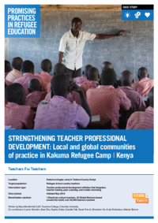

Project Overview: School Attendance and Dropout Patterns in Kakuma

This project aims to analyze and understand the patterns of school attendance and dropout rates within the Kakuma Refugee Camp. Kakuma, located in Kenya, hosts a diverse population of refugees, primarily from South Sudan, Somalia, Ethiopia, and other countries, facing unique educational challenges.

The primary objectives of the study include:

    Assessing Attendance Trends: Monitoring daily, weekly, and seasonal variations in school attendance among different age groups, genders, and nationalities.
    Identifying Dropout Causes: Investigating factors contributing to student dropout, such as economic hardship, language barriers, safety concerns, and limited resources.
    Analyzing Demographic Patterns: Examining how attendance and dropout rates vary based on demographic factors like age, gender, and ethnicity.
    Evaluating Educational Programs: Assessing the effectiveness of current educational interventions and identifying gaps that need addressing.
    Providing Policy Recommendations: Offering data-driven insights to inform policy decisions, improve educational access, and reduce dropout rates within the camp.

Note: The findings of this study are based on the available data and observations within the camp. The authorities and relevant stakeholders do not assume responsibility for any discrepancies or inaccuracies. The project underscores the importance of collaborative efforts and further validation from local authorities for comprehensive insights.

Methodology:
The project will utilize a combination of quantitative data collection methods (surveys, attendance records analysis) and qualitative approaches (interviews, focus groups) to gather comprehensive insights. Data analysis will involve statistical tools and visualizations to identify patterns and trends.

Significance:
Understanding these patterns is crucial for designing targeted interventions to improve school retention and ensure equitable access to quality education for all refugee children and youth in Kakuma. The findings will support stakeholders, including educational authorities, NGOs, and community leaders, in developing sustainable solutions to enhance educational outcomes in the camp.
